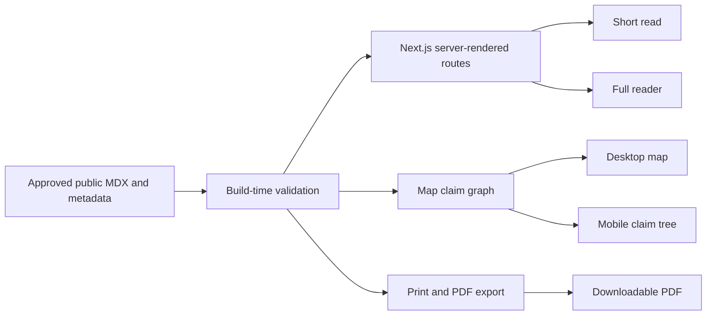

# The Chainfren thesis publication design

**Date:** 2026-07-21  
**Status:** Approved by the user, pending specification review  
**Primary route:** `/thesis`  
**Repository:** `/Users/controlla/chainfren`

## Purpose

Build Chainfren's canonical public publication: a manifesto, company book, thesis, and recruitment document in one public-safe system.

The publication must explain why Chainfren exists, what it believes, what it builds, how its public parts connect, and where the mission is going. It must help creators, brands, partners, recruits, prospective cofounders, executives, and supporters understand the company without access to private company information.

The work must recruit belief without turning into corporate promotion. It must be specific, sourced, honest about product maturity, and written in Chainfren's approved voice.

## Primary outcome

A visitor must be able to answer these questions after reading:

1. Why does Chainfren need to exist?
2. What is wrong with the current creator economy?
3. Why is ownership the next stage after attention?
4. Why does this matter most in Africa?
5. What does Chainfren build today?
6. How do Products and Solutions, Creator Network, Sabi, and Star Factor connect?
7. How does Chainfren turn attention into participation, ownership, and value?
8. What is current, what is early, and what comes later?
9. How can a person or company build with Chainfren?

## Goals

- Create one canonical public body of Chainfren knowledge.
- Combine manifesto force with company-reference clarity.
- Give readers several depths without creating competing stories.
- Support a five-minute read, full reader, ownership map, and PDF from one source system.
- Match the current Chainfren brand system and website.
- Make mobile the primary experience and desktop an expanded version of the same system.
- Keep core content readable without client-side JavaScript.
- Make future reuse possible for Markdown, HTML, slides, audio scripts, video scripts, and partner documents.
- Apply the humanizer process and ADS-STE100 Simplified Technical English.
- Keep all private and sensitive company information out of every output.

## Non-goals

- A private company book or password-protected edition.
- Publication of private financial information, revenue status, runway, or budgets.
- Publication of internal metrics, scoreboards, decision rights, control matrices, risk registers, evidence registers, or detailed operating plans.
- Publication of sensitive partner, creator, customer, or commercial information.
- A full audiobook or explainer film in the first release.
- A new content management system.
- A database, account system, form workflow, or authentication layer.
- WebGL, 3D scenes, scroll hijacking, or autoplay spectacle.
- A rewrite of the main Chainfren website outside the integration needed for `/thesis`.
- Any mention of Comeownity.

## Approved product decisions

### Title

The public title is **The Chainfren thesis**.

### Voice

Chainfren speaks as **we** throughout the publication.

The voice is direct, declarative, Lagos-rooted, culturally specific, and calm. It avoids corporate filler, vague claims, artificial drama, and excessive promotion.

### Edition boundary

There is one public-safe edition. The same public content produces the website, short read, ownership map, PDF, Markdown, and HTML exports.

### Reading model

The publication has two entrances:

1. **The mission:** why Chainfren exists.
2. **The company:** what Chainfren builds and how its public parts connect.

The entrances point to the same chapter set. They do not create separate manuscripts.

The entrance behavior is fixed:

- **Enter through the mission** links to `/thesis/read/the-gap` and starts at Chapter 01.
- **Enter through the company** links to `/thesis/read/the-company` and starts at Chapter 05.
- The canonical table of contents always remains Chapter 01 through Chapter 09.
- The entrance does not create persistent lens state, reorder chapters, or duplicate URLs.
- Previous and Continue follow canonical chapter order. A company-entry reader who selects Previous on Chapter 05 moves to Chapter 04.

### First-release modes

1. Five-minute short read.
2. Full nine-chapter publication.
3. Interactive ownership map.
4. Downloadable PDF.

Audio and film are future formats. The first release may include metadata fields that help later script production, but it must not show empty or disabled audio and video pages.

Clean Markdown and HTML are internal build representations for future reuse. They are not user-facing download modes in the first release and do not appear on `/thesis/download`.

## Source authority

Use sources in this order:

1. Direct user decisions made during this design process.
2. Chainfren Operating Framework v1.1 for current company architecture.
3. The current Chainfren wiki and production repository.
4. The live website audit for approved public language and route reality.
5. The company brief for mission and voice only. Its old three-engine structure is superseded.
6. The operator's essays and public posts for cadence, argument, and thesis lineage.
7. External market data only after current verification and direct citation.

The Obsidian vault is a research source. The implementation must not modify files in its `raw/` directory. Vault content, paths, metadata, and private notes must not ship with the website.

## Publication safety boundary

Use an allowlist model. Only files inside the dedicated public thesis content directory can compile into public outputs.

The publication must not contain:

- Private financial or revenue information.
- Company runway, founder cash position, budgets, or capital limits.
- Internal metrics, operating scoreboards, or private targets.
- Decision-rights matrices or agent control matrices.
- Internal risk registers, evidence registers, or unresolved private disputes.
- Sensitive customer, creator, brand, or partner terms.
- Detailed internal operating roadmaps.
- Local vault paths or raw source filenames.
- Fabricated proof, testimonials, customers, traction, or product maturity.
- Comeownity.

The build must scan generated content for blocked patterns. The blocklist is a final safety net, not the main boundary. The public content allowlist is the main control.

## Editorial architecture

### Chapter 01: The gap

Explain that Africa is online, mobile-first, and culturally influential, but much of the value still leaves the continent and the creator.

Core ideas:

- Adoption is not the main problem.
- Being online is different from benefiting from being online.
- African creators shape global culture.
- The infrastructure beneath that output was built elsewhere and for different users.

### Chapter 02: The trap

Explain the attract-then-extract model and the difference between attention and ownership.

Core ideas:

- Platforms begin by subsidizing reach.
- Creators build audiences on systems they do not control.
- Platforms can change algorithms, take rates, access, and terms.
- The creator owns the work but not the relationship beneath it.

### Chapter 03: The unlock

Explain why crypto and open economic rails matter without making crypto the hero.

Core ideas:

- Open rails can make ownership a system property.
- Mobile wallets and stable value can remove payment friction.
- Blockchains can coordinate ownership, payments, access, and participation.
- Africa needs useful interfaces, not more protocols or whitepapers.

### Chapter 04: The Chainfren thesis

State the central argument.

Approved thesis direction:

> African creators have already won the attention. The next fight is ownership.

The chapter must connect attention, participation, owned relationships, and value. It must explain Chainfren's ambition to become the default attention infrastructure for the African creator economy as an ambition, not a completed fact.

### Chapter 05: The company

Explain Chainfren's public architecture:

- Products and Solutions.
- Creator Network.
- Media, led by Sabi.

Describe the public compounding system. Do not reproduce the private operating framework.

### Chapter 06: What we build

Describe:

- Media Launchpad and TiVi.
- Creator Growth OS.
- Community Engine.
- AI Agent Studio.
- Creator Network.
- Sabi.
- Indy as a directional product and possible integrated future.
- Star Factor as an important later milestone and project inside the Chainfren mission.

Each product or project must show an approved maturity label. Candidate labels are:

- Live.
- Live core.
- Early access.
- Building.
- Directional.
- Later.

The final label for each item must be checked against current public reality before publication.

### Chapter 07: How we work

Publish principles, not private machinery.

Public principles include:

- The customer owns what Chainfren builds.
- Done-with-you work must end in customer self-sufficiency.
- Crypto appears only where it earns its place.
- Human truth starts the work.
- The work is the proof.
- Chainfren says when it is not the right fit.
- Distribution is part of the product.
- Public maturity labels are clear.

Do not publish internal governance, agent authority, cash, metrics, or control systems.

### Chapter 08: The road ahead

Use public horizons, not the internal six-month plan.

The public horizons are:

1. Build and strengthen distribution through Sabi, Creator Network, and the current solution set.
2. Turn reach into owned relationships and direct value through Products and Solutions.
3. Demonstrate the thesis through flagship formats, with Star Factor as a major milestone.
4. Move toward a connected creator business system, with Indy as a directional future.

Do not show private dates, revenue targets, internal gates, budgets, or confidential dependencies.

### Chapter 09: Build with us

Create distinct public entry points for:

- Creators.
- Brands.
- Partners.
- Talent and prospective team members.
- Cofounders and executives.
- Supporters of the mission.

Use one primary CTA per context. Do not create a wall of competing actions.

Use these approved first-release destinations:

| Audience | CTA label | Destination |
|---|---|---|
| Creators | Explore for creators | `/for-creators` |
| Brands | Explore for brands | `/for-brands` |
| Partners | Partner with Chainfren | `/contact` |
| Talent and prospective team members | Join the team | `/contact` |
| Cofounders and executives | Build Chainfren with us | `/contact` |
| Supporters | Follow the work | `/sabi` |

The first release does not add query parameters, form prefilling, or new submission flows. Shared destinations are intentional. The label and surrounding copy provide context.

## The distribution-first system

The publication must make this relationship explicit:

1. **Sabi creates credible attention.** It is Chainfren's owned media and broadcasting surface.
2. **Creator Network organizes relationships and distribution.** It connects brands with creators who move African culture.
3. **Star Factor proves the thesis through a flagship format.** It demonstrates African audience strength, staked entertainment, participation, ownership, and direct value. It sits later in the roadmap but remains central to the mission.
4. **Products and Solutions turn lessons into reusable infrastructure.** They help creators and brands own audiences, payments, data, and relationships.

The public value path is:

> Attention to participation to ownership to value.

This is a public strategic explanation. It must not expose internal company structures or operating mechanics.

## Information architecture

### Routes

| Route | Purpose | Rendering model |
|---|---|---|
| `/thesis` | Cover, premise, mode selection, chapter index | Server rendered |
| `/thesis/short` | Curated five-minute read | Server rendered |
| `/thesis/read/[chapter]` | Full chapter reader | Server rendered with small client islands |
| `/thesis/map` | Ownership map and mobile claim tree | Server shell with lazy client map |
| `/thesis/download` | PDF download | Server rendered |

Invalid chapter slugs return the normal 404 surface.

### Navigation

Mobile:

- Fixed compact header with wordmark and chapter progress.
- Floating bottom reader control with Previous, Contents, and Continue.
- Contents open as an accessible sheet or full-screen panel.
- One primary action per screen.
- Reading progress is saved on the device only.

Desktop:

- Existing Chainfren pill navigation treatment.
- Left chapter rail.
- Center reading column.
- Optional right context rail for short read, map link, source note, and resume state.
- Desktop adds overview. It must not contain required content that mobile lacks.

### Resume reading behavior

Save chapter-level progress only. Do not save exact scroll position or paragraph position.

Use a versioned local-storage record:

```js
{
  chapterSlug: "the-thesis",
  updatedAt: "2026-07-21T12:00:00.000Z",
  contentVersion: "2026.1"
}
```

Rules:

- Update the record when a chapter route becomes active.
- Show `Resume at <chapter title>` on `/thesis` when the stored version matches the current public content version.
- Ignore and replace records with an unknown chapter or old content version.
- Do not restore scroll position.
- Do not sync progress across devices.
- If storage is unavailable, hide Resume and keep all navigation functional.

## Content model

Store public content in a dedicated directory such as:

```text
content/chainfren-thesis/
  manifest.js
  short-read.mdx
  chapters/
    01-the-gap.mdx
    02-the-trap.mdx
    03-the-unlock.mdx
    04-the-thesis.mdx
    05-the-company.mdx
    06-what-we-build.mdx
    07-how-we-work.mdx
    08-the-road-ahead.mdx
    09-build-with-us.mdx
  map.js
```

The exact parser can be MDX or Markdown plus structured metadata. Do not add a CMS unless the existing build makes local MDX impossible.

Each chapter must provide:

```js
{
  id: "04",
  slug: "the-thesis",
  title: "The Chainfren thesis",
  lens: ["mission", "company"],
  summary: "Public summary",
  readingMinutes: 8,
  maturityLabels: [],
  mapClaimIds: ["claim-attention-ownership"],
  publicCitationIds: ["citation-africa-better-internet"],
  updatedAt: "2026-07-21"
}
```

Do not include local source paths, private notes, or raw vault metadata in content objects that can reach the browser.

Keep public maturity labels and CTA destinations in validated public configuration. Chapter prose can refer to them, but it must not define conflicting copies of the same value.

The manifest must define a public `contentVersion`, starting with `2026.1`. The website and PDF must display or embed the same version. The build must also calculate a content hash for verification artifacts. The hash does not need to appear in the visible interface.

### Ownership map schema

The first-release map contains a flat claim graph with twelve required public nodes. It does not add nested subgraphs or user-created nodes.

Required claim IDs:

1. `african-cultural-attention`
2. `african-value-gap`
3. `attract-then-extract`
4. `rented-audience-relationship`
5. `open-economic-rails`
6. `attention-to-ownership`
7. `chainfren-mission`
8. `sabi-attention`
9. `creator-network-distribution`
10. `star-factor-proof`
11. `products-owned-infrastructure`
12. `owned-value-outcome`

Each claim must use this shape:

```js
{
  id: "attention-to-ownership",
  title: "Attention must become ownership",
  summary: "Public plain-language summary",
  type: "mission",
  chapterSlug: "the-thesis",
  order: 6,
  publicCitationIds: []
}
```

Allowed claim types are `context`, `diagnosis`, `mechanism`, `mission`, `distribution`, `proof`, `execution`, and `outcome`.

Each edge must use this shape:

```js
{
  id: "edge-attention-mission",
  from: "african-cultural-attention",
  to: "attention-to-ownership",
  relation: "enables"
}
```

Allowed relations are `causes`, `constrains`, `enables`, `demonstrates`, and `compounds`.

Map behavior:

- Desktop initially fits all twelve nodes in view with `attention-to-ownership` and `chainfren-mission` visually central.
- Selecting a node opens its summary and chapter link without leaving the map.
- Desktop expand and collapse controls show or hide claim detail panels. They do not reveal nested subgraphs.
- Mobile groups claims by type in an accessible vertical tree. Groups start collapsed except `mission`.
- A claim deep link uses `/thesis/map?claim=<claim-id>`.
- A valid deep link focuses the desktop node or expands and focuses the mobile claim.
- An invalid claim parameter shows the default map and does not create an error page.
- Selecting a claim updates the URL with `history.replaceState` so the state can be shared without adding browser-history noise.
- The no-JavaScript fallback renders all twelve claims and their chapter links as a nested server-rendered outline.

## Component boundaries

Prefer focused components with one clear responsibility.

### Server components

- `ThesisHub`: cover and mode selection.
- `ThesisReaderShell`: shared reader structure.
- `ChapterArticle`: semantic article content.
- `ChapterTableOfContents`: chapter order and server links.
- `MaturityBadge`: approved public stage display.
- `PublicCitationList`: public-safe source links.
- `ThesisDownloadPage`: export links and format notes.
- `ThesisMetadata`: route metadata and structured data.

### Client components

- `ReaderProgress`: current chapter and progress display.
- `MobileContentsPanel`: accessible chapter navigation.
- `ResumeReading`: device-local reading state.
- `ShareControl`: native share with clipboard fallback.
- `OwnershipMap`: desktop pan and zoom map, loaded only on `/thesis/map`.
- `OwnershipTree`: mobile expandable claim tree and fallback.

Client components must not receive private source metadata.

## Data flow



The short read is separately edited from the same approved claims. It is not an automatic truncation of the full chapters.

## Visual system

Use the current Chainfren brand system:

- White or warm paper background.
- Navy `#08153C` for text and two-pixel borders.
- Bordered cards with 26 to 28 pixel radii.
- Product colors keep their current assignments.
- Inter Display with the current capped weight scale.
- Georgia only for approved accent roles.
- Italic emphasis as the signature headline device.
- Cards lift on hover. They do not scale.
- Blur is limited to navigation and floating reader controls.
- The fren system is the main illustration language.
- No stock photography is required.
- No emoji.

The publication may use quieter, longer reading surfaces than the homepage. It must still feel like the same brand.

### Canonical brand fidelity

Every brand element used by the publication must come from the canonical Chainfren design system or the matching production component. Do not redraw, reinterpret, stretch, recolor outside approved treatments, or replace a brand asset with a close approximation. This applies to:

- The Chainfren wordmark and linked-frens mark.
- Fren poses, proportions, stroke geometry, duo-color treatments, and contextual choreography.
- Product and sub-brand color assignments.
- Inter Display typography, capped weight scale, Georgia accent roles, spacing, radii, borders, shadows, and gradients.
- Lucide-style interface icons with two-pixel strokes, round caps, and `currentColor`.
- Motion curves, timings, hover lifts, focus effects, blur, palette transitions, and reduced-motion behavior.
- Approved 3D iridescent renders, wave masks, favicons, and other production assets when they appear.

Use the existing production components in `app/components` first, including `ChainfrenWordmark`, `ChainfrenIcon`, and `Frens`. Use the existing files in `public` for decorative assets. If a canonical design-system asset is not yet present in the repository and the design needs it, copy the exact source asset into the repository without changing it and record its source checksum in the release review.

The publication does not need to display every asset in the design system. It must use the exact canonical implementation for every asset, icon, animation, and effect that it does display. New publication interactions can be composed from approved tokens and motion primitives, but they must not invent a parallel Chainfren visual language.

## Immersion and motion

Immersion comes from:

- Strong entry pacing.
- Chapter progress.
- Large, low-weight typography.
- Carefully timed section reveals.
- Spatial transitions between argument, company, and map views.
- Contextual fren illustrations.
- Clear continuity between chapters.

Do not use:

- Scroll hijacking.
- Heavy parallax.
- WebGL.
- Autoplay video.
- Continuous decorative animation.
- Motion that hides or delays text.

All motion must honor `prefers-reduced-motion`.

## Responsive behavior

Mobile is the primary design target.

Required widths:

- 360 pixels.
- 390 pixels.
- 768 pixels.
- 1280 pixels.
- 1440 pixels.

Mobile rules:

- One reading column.
- No horizontal page overflow.
- Touch targets are at least 44 by 44 CSS pixels.
- The map becomes a vertical expandable claim tree.
- Decorative images load after core content.
- The bottom reader control does not cover text.
- Text measure remains readable.
- Chapter contents work with keyboard and touch.

Desktop rules:

- The reading column remains the visual focus.
- Side rails add orientation and context only.
- The full map can use pan, zoom, fit, expand, and collapse controls.
- The same URLs and content work at all widths.

## Performance design

Core principles:

- HTML before JavaScript.
- Server-render all primary reading content.
- Keep interaction inside small client islands.
- Lazy-load the ownership map only on its route.
- Do not load desktop map code on the reader or short-read routes.
- Use responsive AVIF or WebP images.
- Use explicit media dimensions to prevent layout shift.
- Reuse self-hosted Chainfren fonts.
- Do not add another font family.
- Lazy-load decorative media below the fold.

Budgets for publication routes:

- Route-specific JavaScript below 70 KB compressed.
- Critical first-load transfer below 500 KB compressed.
- Largest Contentful Paint below 2.5 seconds at the 75th percentile on mobile.
- Cumulative Layout Shift below 0.1.
- Interaction to Next Paint below 200 milliseconds.
- No blocking third-party scripts.

If the existing global site shell prevents a budget, the implementation report must identify the inherited cost separately from publication route cost. Do not remove brand or accessibility features to pass a budget.

### Pre-release and field measurement

Pre-release gates use lab measurements. Run at least three cold Lighthouse or equivalent Chromium measurements under the same simulated slow-4G mobile profile and use the median.

Pre-release lab gates:

- Median lab Largest Contentful Paint below 2.5 seconds.
- Median lab Cumulative Layout Shift below 0.1.
- Median Total Blocking Time below 200 milliseconds.
- Route-specific JavaScript and critical-transfer budgets pass.

Interaction to Next Paint at the 75th percentile is a post-launch field target, not a pre-release lab gate. If the existing Chainfren site already collects Core Web Vitals, monitor publication routes after release. This project does not add a new analytics or telemetry service. Deployment and post-launch monitoring require separate authorization.

## Accessibility

- Use semantic landmarks and one clear `h1` per route.
- Keep heading levels sequential.
- Provide a skip link.
- Keep visible keyboard focus.
- Support keyboard operation for contents, sharing, map controls, and accordions.
- Trap focus only inside true modal surfaces.
- Restore focus after a mobile contents panel closes.
- Provide text alternatives for fren illustrations and diagrams when they carry meaning.
- Mark decorative art as decorative.
- Meet WCAG AA contrast.
- Keep body text at a readable size and line height.
- Provide a nested text outline as the ownership map fallback.
- Never put required information only inside motion or hover.

## PDF and reusable exports

The PDF uses the same canonical public content with a dedicated print layout.

PDF requirements:

- Branded cover.
- Table of contents.
- Stable chapter page breaks.
- Page numbers.
- Public citations.
- Readable color in print and grayscale.
- Clickable links.
- No navigation chrome or interactive-only instructions.
- No clipped cards, maps, or headings.

Preserve clean public Markdown and HTML as internal build representations for future reuse. Do not publish them as downloadable first-release artifacts. Future audio and film scripts can derive from approved chapters, but they are not first-release outputs.

## Search and sharing

- Unique metadata for hub, short read, chapters, map, and download page.
- Canonical URLs.
- Open Graph and social preview for the publication and major chapters.
- Article structured data where appropriate.
- Descriptive titles and summaries.
- Server-rendered text for search indexing.
- Deep links to chapters and map claims.
- Native share on supported mobile devices with clipboard fallback.

## Failure handling

- If JavaScript fails, chapters and server links remain usable.
- If progress storage is unavailable, reading continues without saved state.
- If native sharing fails, offer copy link.
- If the desktop map fails, show the complete nested ownership tree.
- If a map node refers to a missing claim or chapter, fail the build.
- If a chapter has missing required metadata, fail the build.
- If the PDF build fails, the website build reports the failure clearly. Do not publish a broken download link.
- If an external citation is unavailable, keep the claim only when another approved source supports it. Otherwise remove or qualify the claim.
- Invalid chapter slugs use the normal 404 page.

## Editorial workflow

Each chapter passes through these stages:

1. Source extraction with claim notes.
2. First draft in Chainfren's `we` voice.
3. Humanizer draft audit.
4. Humanizer final rewrite.
5. ADS-STE100 review.
6. Factual and maturity review.
7. Public-safety review.
8. Responsive content review in the real interface.

Humanizer requirements:

- Preserve meaning and specific evidence.
- Remove AI writing patterns.
- Keep natural rhythm and opinion where appropriate.
- Avoid inflated significance, fake depth, vague authority, rule-of-three overuse, corporate promotion, and generic conclusions.
- Do not use em dashes or en dashes.

ADS-STE100 requirements:

- Prefer active voice.
- Keep sentences clear and direct.
- Use one term for one concept.
- Define technical terms before use.
- Keep instructions and product descriptions concrete.
- Use short sentences where they improve clarity.
- Do not flatten the manifesto into technical documentation. Preserve voice while keeping the meaning clear.

## Claim discipline

Separate fact, position, and ambition.

Examples:

- Current position: Chainfren builds ownership infrastructure for the African creator economy.
- Thesis: Attention is no longer enough. Ownership is the next stage of growth.
- Ambition: Chainfren intends to become the default attention infrastructure for the African creator economy.
- Maturity: Star Factor is a later milestone and proof project. It is not presented as a current shipped product.

All market figures must include a date and public source. Remove a number when its source cannot be verified.

## Testing

### Content integrity

- Validate required chapter metadata.
- Validate unique chapter, claim, and citation IDs.
- Validate map edges and chapter links.
- Validate the nine-chapter order.
- Validate approved maturity labels.
- Scan generated outputs for local paths and blocked private patterns.
- Verify Comeownity does not appear in any publication output.
- Verify no fabricated proof or unsupported customer claims appear.

### Functional testing

- Hub mode selection.
- Short read navigation.
- Previous, Contents, and Continue controls.
- Direct chapter URLs.
- Mission entrance opens Chapter 01.
- Company entrance opens Chapter 05.
- Canonical Previous and Continue order from both entrances.
- Chapter-level Resume with valid, stale, invalid, and unavailable storage states.
- Native share and clipboard fallback.
- Desktop map pan, zoom, fit, expand, and collapse.
- Mobile ownership tree expand and collapse.
- Valid and invalid map claim deep links.
- PDF link and file delivery.
- 404 behavior for invalid chapter slugs.

### Responsive testing

Test 360, 390, 768, 1280, and 1440 pixel viewports.

Check:

- No horizontal overflow.
- No hidden or covered text.
- Mobile control clearance.
- Reader line length.
- Chapter rail behavior.
- Map and tree behavior.
- Touch target size.
- Typography and card geometry.
- Portrait and landscape tablet behavior.

### Accessibility testing

- Keyboard-only navigation.
- Screen-reader landmark and heading review.
- Focus order and restoration.
- Color contrast.
- Reduced-motion behavior.
- High zoom and large text.
- Diagram alternatives.
- Print accessibility and link text.

### Performance testing

- Production build analysis for each publication route.
- Lighthouse mobile runs under simulated slow 4G.
- Pre-release lab performance checks using the defined median-of-three profile.
- JavaScript and transfer budget checks.
- Confirm map code is absent from reader route bundles.
- Confirm below-fold art does not compete with the first text render.

### Visual testing

Capture and compare screenshots at all required widths for:

- Hub.
- Short read.
- One early chapter.
- One company chapter.
- Ownership map or tree.
- Download page.
- PDF cover and representative interior pages.

## Acceptance criteria

The design is complete when:

- `/thesis` and all approved child routes build successfully.
- The four approved exploration modes work.
- The full reader contains nine chapters.
- Mission and company entrances reach the same canonical content.
- Mission opens Chapter 01 and company opens Chapter 05 without persistent lens state or chapter reordering.
- Comeownity is absent.
- Star Factor is presented as an important later Chainfren milestone and proof project.
- Sabi, Creator Network, Star Factor, and Products and Solutions form a clear distribution-first story.
- Public content does not expose private company information or internal frameworks.
- Maturity labels match current approved public reality.
- The publication matches the Chainfren design system.
- Every logo, mark, fren, icon, animation, effect, color treatment, and decorative asset used by the publication matches its canonical brand implementation or source file.
- No Chainfren logo, mark, fren, or approved decorative asset is redrawn or approximated.
- Mobile and desktop experiences pass responsive, accessibility, and visual checks.
- Performance budgets pass or inherited global costs are isolated and documented.
- Core content remains readable without JavaScript.
- The ownership map has a complete mobile and no-JavaScript text fallback.
- The ownership map implements the approved twelve-node schema and claim deep-link behavior.
- The PDF comes from the same approved public content and passes visual review.
- The website and PDF use the same public content version and build hash.
- Markdown and HTML remain internal build representations, not first-release download modes.
- Resume stores chapter-level progress only and handles stale or unavailable storage without blocking reading.
- Pre-release lab performance gates pass. Field percentile targets are not treated as lab release gates.
- Humanizer, ADS-STE100, factual, maturity, and public-safety reviews are complete.

## Implementation sequence constraints

The implementation plan must keep content and interface work coordinated. Do not write final chapters against placeholder components, and do not finalize components against lorem ipsum.

Recommended sequence:

1. Build schema, route skeleton, public-safety validation, and two representative chapter samples.
2. Build mobile reader and desktop expansion with real representative copy.
3. Validate performance and accessibility before adding the full content set.
4. Draft and review all nine chapters.
5. Build the ownership map from approved claims.
6. Build PDF and export formats.
7. Run full responsive, content, safety, performance, and visual verification.

## Deferred work

- Audiobook.
- Explainer film.
- Podcast distribution.
- Translations.
- Offline application behavior.
- CMS integration.
- User accounts or cross-device reading history.
- Private or gated company editions.

## Final approved design statement

The Chainfren thesis is one public-safe canonical publication with two entrances and four exploration modes. It explains Chainfren's mission and company through a nine-chapter argument. It presents Sabi, Creator Network, Star Factor, and Products and Solutions as a distribution-first system that turns attention into participation, ownership, and value. It treats Star Factor as a major later milestone that can prove Chainfren's theses on African audiences and staked entertainment. It excludes Comeownity and all private company information. The experience is mobile-first, immersive, polished, intuitive, and fast, with desktop adding context rather than required content.
